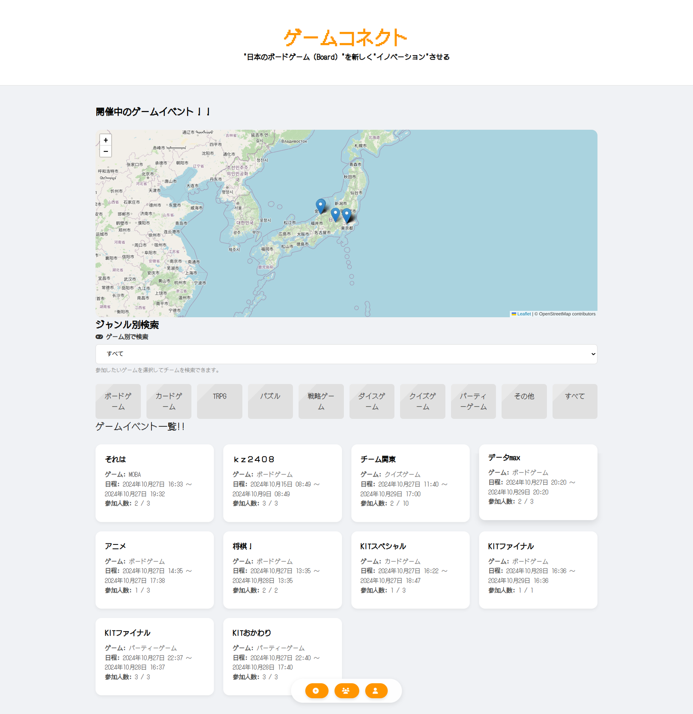

# ゲームコネクト

<!--  -->

# 製品URL
実際に下記のURLでサービスを利用することができます。 
https://anime-create.com/hack/gameconnect.html

## 製品概要
### 背景(製品開発のきっかけ、課題等）

コロナ禍で人と人とのつながりが減ってきました。
特に、今回ユーザー層として定めた以下の特徴を持つ人たちは、孤独や運動不足という課題を抱えています。
今回はユーザーとして、仮想ペルソナを以下の特徴を持つ方にしました。
- 10代~20代
- オタク
- 学生
- 男性
すなわち、我々です！
我々技術オタクは、その性質上、孤独になりやすいです。
孤独は寿命を短めます。

### 製品説明（具体的な製品の説明）

<!-- ここは岡崎さんに説明してもらう。もしくはヒアリングをしながら書き起こす -->
#### デモ動画

### 特長
#### 1. オフラインのゲームを前提とするため外に出るきっかけを作れる！
#### 2. 人と人とのつながりを深めるため、温かみのある色彩にしました。
#### 3. Webアプリなのでインストールの必要性がない!

### 解決出来ること

このサービスは人と人とのつながりを想像し、ユーザーの孤独と運動不足を解消します！
<!-- ここにボードゲーム業界の活性化の旨を入れる -->

### 今後の展望

- 実装できていない機能
    - 自己紹介文からプレイヤーがどんな人なのかをグラフで可視化する機能
        HTTPS通信が実現できなかった
    

### 注力したこと（こだわり等）

<!-- 黒瀬 -->

- 仮想ペルソナを明確にし、この機能がどのようにユーザーの課題を解決するのか考えながら実装した。
- 人と人のつながりを深めるため、温かみのある色彩を意識した。

<!-- 岡崎さん -->
- 今回のデモで動作するコードは１つのhtmlで完結させた
- オープンソースの地図をはじめ、外部APIを最小限にとどめたことにより拡張性とサーバ費を少なく済ませた
- 私たちだけでなくトランプやボードゲームなどのゲーム会社にとってメリットがあるアプリを開発した
- Leaflet.jsを使って、チームの開催場所を地図上で確認できる機能を実装した
- チームに参加した後、レビューやチャットを通じてフィードバックを提供できる仕組みを取り入れた

<!-- 浦澤さん -->

- アプリ内の文字のフォントや競合調査をし、ユーザーの人数を数値化した
- 孤独な人とそうでない人の致死率など、人数、年代、性別など

<!-- これより下は岡崎さんにお願いする -->

## 開発技術
### 活用した技術
#### API・データ
* 
* 

#### フレームワーク・ライブラリ・モジュール
* 
* 

#### デバイス
* 
* 

### 独自技術
#### ハッカソンで開発した独自機能・技術
* 独自で開発したものの内容をこちらに記載してください
* 特に力を入れた部分をファイルリンク、またはcommit_idを記載してください。
